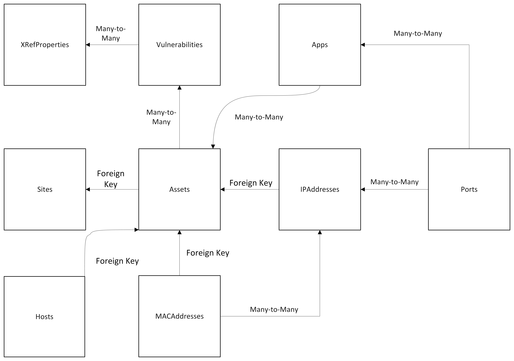

# Asset ISC-CAR

Asset CAR Connector
```
I.   SUMMARY
II.  PREREQUISITES
III. INSTALLATION
IV.  EXAMPLE USAGE (command line)
V.   INITIAL IMPORT
```

I. SUMMARY:
-----------------------------------------------------------------
This connector simplifies the process of loading data into CAR. Users can import data from files directly into CAR without the need to manage servers, resulting in faster data loading times.

II. PREREQUISITES:
-----------------------------------------------------------------
Python == 3.9.7 (greater than 3.9.x may work, less than probably will not; neither is tested)

The data within files adheres to the schema outlined in the reference connector. Refer the [developer guide](https://github.com/IBM/cp4s-car-connectors/tree/develop/connectors/reference_connector/server).

To load sample data, start the server in the Reference Connector. Then, make an API call to the specified endpoint. Save the response as a JSON file.

Check out sample data for all endpoints at: https://github.com/IBM/cp4s-car-connectors/sample/data

Here's a concise overview of its asset mapping. 
Each file is dedicated for every end point and the asset bundle importer cunnrntly supports ``` vulnerabilities , sites , assets ,ip_addresses' ,mac_addresses , hosts , apps , ports```

The following table shows the mapping for Files as CAR asset service endpoints.

|  File Name  |   CAR endpoint   |
|  :------------:    |:---------------:| 
|vulnerabilities    |vulnerability|
|sites              |site|
|assets             |asset|
|ip_addresses       |ipaddress|
|mac_addresses      |macaddress|
|hosts              |hostname|
|apps               |application|
|ports              |port|

Schema for each file:

|  File           |   Fields               | Relationship |
|  :------------:    |:---------------:     |:---------------:| 
| xrefproperties   |   pk                  | primary key   |
|                  |extref_typename         |character field|
|                  |extref_value            |character field|
|                   |q_extref_typeid        |integer field  |
|vulnerabilities    |pk                     |primary key    |
|                   |name                   |character field|
|                   |published_on            |Integer field|
|                   |disclosed_on           |Integer field|
|                   |updated_on             |Integer field|
|                   |vcvssbmid              |integer field|
|                   |base_score             |float field|
|                   |xref_properties        |many-to-many relationship with XRefProperty|
|sites               |pk                     |primary key|
|                   |name                   |character field|
|                   |address                |character field|
|assets             |pk                     |primary key    |
|                   |name                   |character field|
|                   |type                   |character field|
|                   |initial_value           |float field|
|                   |site                    |foreign key relationship with Site|
|                   |vulnerabilities        |many-to-many relationship with Vulnerability|
|ip_addresses          |pk                     |primary key    |
|                   |name                   |character field|
|                   |address                   |character field|
|                   |asset           |A foreign key relationship with Asset|
|mac_addresses         |pk                     |primary key    |
|                   |address                   |character field|
|                   |asset           |A foreign key relationship with Asset|
|                   |ip_addresses                   |A many-to-many relationship with the IPAddress model.|
|hosts               |pk                     |primary key    |
|                   |host                   |character field|
|                   |asset           |A foreign key relationship with Asset|
|ports         |pk                     |primary key    |
|                   |port_number                   |integer field|
|                   |layer7application                   |character field|
|                   |protocol                |character field|
|                   |apps           |A many-to-many relationship with App|
|                   |ip_addresses                   |A many-to-many relationship with the IPAddress model.|
|apps         |pk                     |primary key    |
|                   |name                   |character field|
|                   |assets           |A many-to-many relationship with Asset|


For a comprehensive understanding of the schema, refer: ```https://github.com/IBM/cp4s-car-connectors/blob/develop/connectors/reference_connector/server/assets/models.py```

III. INSTALLATION:
-----------------------------------------------------------------
- Requirements.txt file attached.


IV. EXAMPLE USAGE (command line):
-----------------------------------------------------------------

```Usage: app.py [arguments]```

required arguments in command line:

```
positional arguments:

-host                       :base URL / root URL(https://raw.githubusercontent.com/IBM/cp4s-car-connectors/develop/sample/data)
-car-service-url            :CAR DB url
-car-service-key            :api_key
-car-service-password       :password
-source                     :data source
```

## Connector

Install python dependencies
```
pip3 install -r requirements.txt
```

Running the connector:
```
python3 app.py -car-service-url="<car-service-url>" -car-service-key="<car-service-key>" -car-service-password="<car-service-password>" -source=asset -host="<root-url>"
```

V. INITIAL IMPORT
-----------------------------------------------------------------
When we run the connector First time. It loads all the asset and their entities available from the source into CAR database.